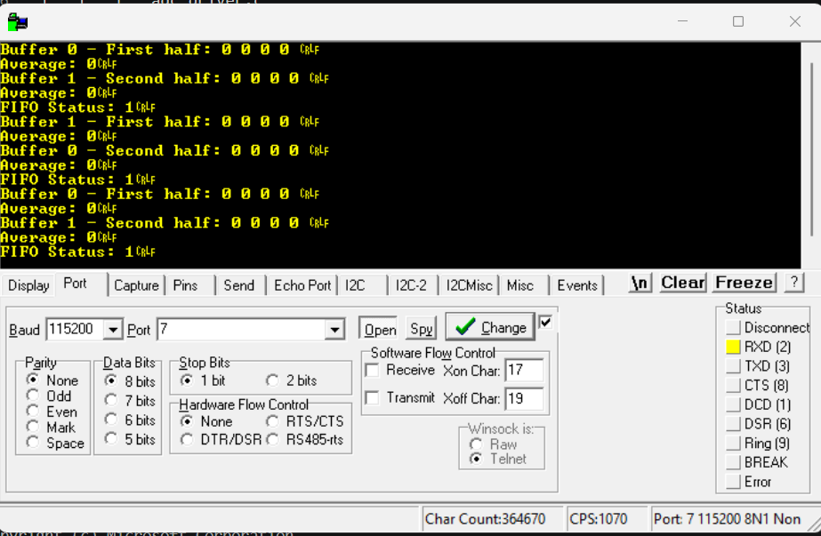
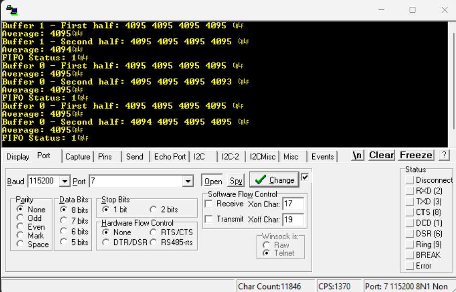

# dma_data_logger

````markdown
# STM32 DMA ADC Data Acquisition & Double Buffering

A register-level embedded systems project on the **STM32 Nucleo-F446RE** demonstrating ADC data acquisition using **DMA2 Stream 0**. The project progresses from basic DMA transfers to interrupts, FIFO configuration, error handling, burst transfers, and finally **double-buffer mode** for continuous data acquisition.

---

## Features

- Register-level programming — no HAL
- ADC-to-memory DMA transfer
- Circular DMA mode
- Half-transfer & transfer-complete interrupts
- DMA transfer, direct-mode & FIFO error handling
- DMA FIFO mode with 1/2-full threshold
- Memory burst transfer (INCR4)
- DMA double-buffer mode
- Current/completed buffer detection
- ADC sample averaging
- UART-based monitoring

---

## Hardware

- **STM32 Nucleo-F446RE**
- Configured ADC input
- USB Virtual COM Port
- RealTerm / Serial Terminal

---

## Project Structure

```text
STM32_DMA_ADC/
│
├── Core/
│   ├── Src/
│   │   ├── main.c
│   │   ├── gpio_driver.c
│   │   ├── uart_driver.c
│   │   ├── systick_driver.c
│   │   ├── adc_driver.c
│   │   └── dma_driver.c
│   │
│   └── Inc/
│       ├── gpio_driver.h
│       ├── uart_driver.h
│       ├── systick_driver.h
│       ├── adc_driver.h
│       └── dma_driver.h
│
├── Images/
│   ├── dma_uart_output_gnd.png
│   └── dma_uart_output_3v3.png
│
└── README.md
````

---

## DMA Configuration

| Parameter        | Configuration       |
| ---------------- | ------------------- |
| Controller       | DMA2                |
| Stream           | Stream 0            |
| Channel          | Channel 0           |
| Direction        | Peripheral → Memory |
| Source           | ADC1 Data Register  |
| Peripheral Size  | Half-word           |
| Memory Size      | Half-word           |
| Memory Increment | Enabled             |
| Circular Mode    | Enabled             |
| FIFO             | Enabled             |
| FIFO Threshold   | 1/2 Full            |
| Memory Burst     | INCR4               |
| Peripheral Burst | Single              |
| Double Buffer    | Enabled             |
| Buffer Size      | 8 samples           |

---

## System Architecture

```text
              ADC1
               │
               ▼
        ADC Data Register
               │
               ▼
        DMA2 Stream 0
          │         │
          ▼         ▼
      Buffer 0   Buffer 1
          │         │
          └────┬────┘
               ▼
              CPU
               │
               ▼
             UART
               │
               ▼
           RealTerm
```

DMA continuously transfers ADC samples while the CPU processes completed data buffers.

---

## Double Buffering

Two memory buffers are used:

```text
Buffer 0 → adc_buffer0[8]
Buffer 1 → adc_buffer1[8]
```

DMA alternates between them:

```text
DMA fills Buffer 0
       ↓
Buffer 0 complete
       ↓
DMA switches to Buffer 1
       ↓
CPU processes Buffer 0
       ↓
Buffer 1 complete
       ↓
DMA switches to Buffer 0
       ↓
CPU processes Buffer 1
       ↓
Repeat
```

The DMA `CT` bit is used to determine the **current buffer**, while the opposite buffer is treated as the **completed buffer** after transfer completion.

---

## Interrupts & Error Handling

The DMA driver handles:

* Half-transfer interrupt
* Transfer-complete interrupt
* Transfer error
* Direct-mode error
* FIFO error

Interrupt events are converted into software flags that are processed by the main application.

---

## UART Output

The application displays:

* ADC samples
* Average ADC value
* Current/completed buffer information
* FIFO status
* DMA errors

Example:

```text
Buffer 0 - First half: XXXX XXXX XXXX XXXX
Average: XXXX

Buffer 0 - Second half: XXXX XXXX XXXX XXXX
Average: XXXX

Buffer 1 - First half: XXXX XXXX XXXX XXXX
Average: XXXX

Buffer 1 - Second half: XXXX XXXX XXXX XXXX
Average: XXXX
```

---

## Images

### Hardware Setup

<p align="center">
  
</p>

### UART Output

<p align="center">
  
</p>

---

## Results

* Successfully implemented ADC-to-memory DMA transfers.
* Implemented interrupt-driven DMA monitoring.
* Configured FIFO and burst transfers.
* Implemented DMA error detection.
* Implemented continuous double-buffered ADC acquisition.
* Processed ADC data while DMA continued transferring samples.
* Displayed acquisition results through UART.

---

## Learning Outcomes

This project strengthened understanding of:

* STM32 DMA architecture
* Register-level peripheral configuration
* DMA interrupts
* FIFO and burst transfers
* Circular and double-buffer modes
* ADC-DMA integration
* Interrupt-driven data processing
* Embedded driver architecture

---

## Author

**Riddhi Sridhar**
Electronics and Communication Engineering
RV College of Engineering

```
```
